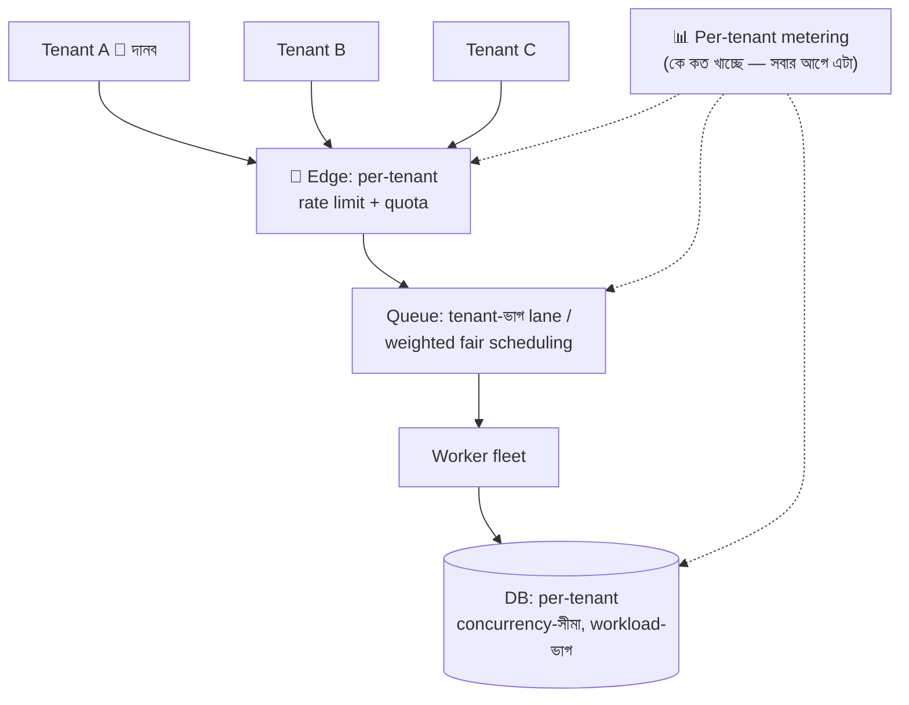

# Day 51 — Multi-Tenant SaaS-এ Noisy Tenant Isolation

## 🎯 সমস্যা

Multi-tenancy-র অর্থনীতিই হলো ভাগাভাগি — এক infra, শত tenant, খরচ ভাগ। আর সেই ভাগাভাগিরই অন্ধকার দিক: এক দানব-tenant-এর bulk-import/রিপোর্ট-ঝড়/ভাঙা-integration-এর retry-বন্যা — আর বাকি ৯৯ জনের app ধীর। তারা তো জানেই না প্রতিবেশী কে; তারা শুধু জানে **আপনার** SaaS আজ খারাপ। Noisy-neighbor সমস্যা আসলে fairness-এর প্রশ্ন: **ভাগ-করা জিনিসে সীমা কে টানবে, কোথায় টানবে?**

## 🖼️ প্রতিরক্ষার স্তর

## 💡 স্তরে স্তরে

**1. সবার আগে: per-tenant দৃশ্যমানতা — নাহলে সবটাই অন্ধ লড়াই।** প্রতিটা request/job/query-তে tenant-ID ট্যাগ (log, metric, trace — Day 58-এর সুর); dashboard-এ "শীর্ষ-১০ ভোক্তা এখন কে" — CPU, DB-time, queue-slot, storage। Day 49-এর সেই আয়না-নীতি: **মাপতে না পারলে শাসন হয় না।** Incident-এর রাতে "কোন tenant?" প্রশ্নের উত্তর ৩০ সেকেন্ডে না এলে বাকি সব নকশা কাগুজে।

**2. দরজায় বেড়া: per-tenant rate limit + quota — Day 03-এর যন্ত্র, tenant-মাত্রায়।** Global limit যথেষ্ট না — দানব একাই global খেয়ে ফেলে; সীমা টানুন **tenant-প্রতি** (আর তার ভেতরে user-প্রতি), plan-ভেদে ভিন্ন (free বনাম enterprise), burst-সহনশীল (token-bucket)। আর সীমা মানে শুধু আটকানো নয় — **সংকেত**: 429 + Retry-After + "আপনার plan-সীমা" — দানব-tenant-কে upsell-এর দরজাও এটাই (fairness-সমস্যাকে pricing-সমাধানে রূপান্তর — SaaS-এর পরিণত চাল)।

**3. মাঝের স্তর: ভাগ-করা queue-তে fairness।** এক queue-তে সবার কাজ মানে দানবের ১০ হাজার job-এর পেছনে ছোট-tenant-এর ১টা (Day 25-এর priority-পাঠের tenant-রূপ)। পথ: **tenant-প্রতি lane/partition + worker-রা round-robin/weighted-fair টানে** (দানব বেশি পাবে, কিন্তু কাউকে অভুক্ত রেখে নয়), বা অন্তত দুই-শ্রেণি (interactive-ছোট বনাম bulk-ভারী lane — bulk-import সবসময় আলাদা lane-এ, এ নিয়মটাই অর্ধেক শান্তি)। Per-tenant **in-flight concurrency-সীমা** ("একসাথে সর্বোচ্চ N ভারী-job") প্রায়ই rate-limit-এর চেয়েও কার্যকর — কারণ ব্যথাটা হার-এ নয়, দখলে।

**4. গভীরতম স্তর: data-স্তরে বিস্ফোরণ-প্রাচীর।** Multi-tenant DB-নকশার চিরন্তন ত্রয়ী — **shared-schema (সব এক টেবিলে, tenant_id-কলাম)** ↔ **schema-per-tenant** ↔ **database-per-tenant** — বাঁ-থেকে-ডানে isolation বাড়ে, খরচ-আর-পরিচালন-জটিলতাও। বাস্তব উত্তর প্রায়ই **সংকর**: ভিড়টা shared-pool-এ (সস্তা), দানব/নিয়ন্ত্রক-দাবিওয়ালা tenant-রা নিজস্ব ঘরে — আর সেই **স্থানান্তরের যন্ত্র** (shared→dedicated অভিবাসন, Day 05-এর directory-ভিত্তিক routing: tenant→কোন-ঘর lookup) প্রথম দিনেই নকশায়; নাহলে দানব ধরা পড়বে, সরানোর পথ থাকবে না। Shared-ঘরের ভেতরেও ঢাল আছে: per-tenant query-timeout, DB-র workload-management/resource-group (ভারী-রিপোর্ট নিজস্ব pool-এ — Day 13-এর ভাগ-করা-pool পাঠ), tenant-ভাগ read-replica।

**5. আর noisy-র সংজ্ঞাটাও লিখুন — নীতি ছাড়া প্রযুক্তি অন্ধ।** কত হলে "noisy"? তখন কী — throttle, degrade (তার রিপোর্ট ধীর-lane-এ), জানানো, upsell? SLA-ভেদে কার ঢাল কত? এগুলো product-সিদ্ধান্ত (Day 20-র fallback-দর্শন: ব্যবসাই ঠিক করবে) — engineering দেবে enforcement-এর যন্ত্র।

## ⚖️ সিদ্ধান্ত-ছক

| স্তর | অস্ত্র |
|------|--------|
| দরজা | Per-tenant rate limit + plan-quota + concurrency-cap |
| Queue/worker | Tenant-lane + weighted-fair, bulk-আলাদা |
| DB | Timeout, resource-group, সংকর tenancy (ভিড় shared, দানব dedicated) |
| ব্যবসা | Metering→billing→upsell — fairness-কে revenue বানানো |
| সবার নিচে | Per-tenant observability — এটা ছাড়া বাকি সব অনুমান |

## ⚠️ Common Mistakes

- Global-মেট্রিকে সুস্থ, tenant-মেট্রিকে মৃত — গড় p99 ঠিক, কিন্তু ছোট-tenant-দের p99 জাহান্নামে; percentile-ও tenant-ভাগে দেখুন।
- দানবকে শাস্তি-মডেলে দেখা — সে তো সবচেয়ে দামি গ্রাহক! লক্ষ্য বিতাড়ন নয়, **নিয়ন্ত্রিত সেবা**: তার bulk-ও চলুক, অন্যের interactive-ও বাঁচুক।
- Isolation "পরে করব" — shared-schema-তে লাখো-row জমার পরে dedicated-এ সরানো এক মহাযজ্ঞ (Day 53-এর migration-যন্ত্রণা × tenant-চুক্তি); অন্তত routing-lookup-স্তরটা (কোন tenant কোথায়) প্রথম দিনেই।
- Rate-limit আছে, job-দখল-সীমা নেই — API-দরজায় ভদ্র, ভেতরে তার ১০-ঘণ্টার রিপোর্ট সব worker দখলে; দুটো আলাদা বেড়া।

## 🎤 Interview Tip

কাঠামোটা এক নিঃশ্বাসে: **"আগে per-tenant metering — না মাপলে শাসন নেই; তারপর স্তরে স্তরে বেড়া — দরজায় rate/quota, queue-তে fair-scheduling আর bulk-আলাদা-lane, DB-তে timeout/resource-group, আর দানবদের জন্য সংকর-tenancy: সরিয়ে নেওয়ার routing-যন্ত্রসহ।"** শেষে ব্যবসা-মোচড়: **"Noisy tenant আসলে pricing-সংকেত — সীমা ছোঁয়া মানে হয় ঢাল, নয় upsell; দুটোই win।"**
