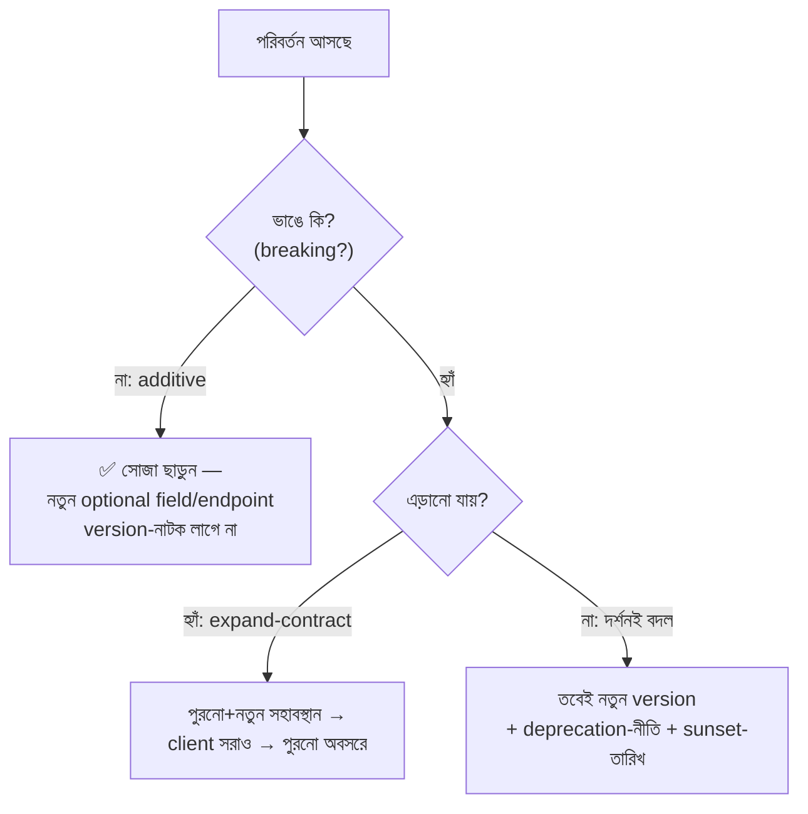

# Day 52 — Client না ভেঙে API Versioning

## 🎯 সমস্যা

API-টা published — mobile-app-এর পুরনো সংস্করণ (user update করে না!), partner-দের integration, নিজেরই পুরনো frontend — সবাই আজকের চুক্তিতে বাঁচে। এখন field-এর নাম বদলাতে হবে, response-কাঠামো গোছাতে হবে, ভুল-নকশা শোধরাতে হবে। এক পাশে টান: "সব v2-তে নতুন করে"; অন্য পাশে সত্য: **প্রতিটা version একটা চিরকালের সন্তান** — রক্ষণাবেক্ষণ, নিরাপত্তা-প্যাচ, ডকুমেন্টেশন — সব ×N। Versioning-এর আসল কৌশল তাই version *কম* বানানোর কৌশল।

## 🖼️ সিদ্ধান্তের স্তর

## 💡 নীতিগুলো

**1. আগে সংজ্ঞা: breaking মানে কী?** ভাঙে: field মোছা/নাম-বদল, type-বদল, required-নতুন-input, enum-মান মোছা, error-কাঠামো বদল, semantics-বদল (একই field, নতুন অর্থ — সবচেয়ে ধূর্ত)। ভাঙে **না**: নতুন optional field, নতুন endpoint, নতুন enum-মান *যদি client-চুক্তিতে "অচেনা মান সহ্য করো" লেখা থাকে*। এখান থেকেই দুই সোনার নিয়ম:
- **Server: additive-first** — যা যোগ করা যায়, বদলে নয় যোগেই করুন;
- **Client: tolerant reader** — অচেনা field উপেক্ষা, অচেনা enum-এ default-আচরণ; client-SDK/ডক-এ এ দাবি প্রথম দিন থেকে লিখুন — এ শৃঙ্খলা থাকলে ৮০% "breaking" জন্মেই না। (Day 11/22-এর event-consumer-দের জন্যও অবিকল একই নিয়ম — API আর event, দুটোই চুক্তি।)

**2. ভাঙা-বদল এলেও প্রথম অস্ত্র version নয় — expand-contract (Day 14/53-এর সেই ছন্দ, চুক্তি-স্তরে):** নতুন field পুরনোটার *পাশে* ছাড়ুন (দুটোই populate), client-দের সরান, ব্যবহার-মেট্রিকে পুরনোটা শূন্যে নামলে তবে মুছুন। এক endpoint-এর ভেতরে ছোট-বিবর্তন এভাবেই — সংস্করণ-সংখ্যা না বাড়িয়ে।

**3. তবু version লাগলে — কোথায় বসবে?** URL-path (`/v2/orders` — দৃশ্যমান, cache/log-বান্ধব, সবচেয়ে প্রচলিত), header/content-negotiation (URL-পবিত্রতা, কিন্তু অদৃশ্য — debug/ডক কঠিন), query-param (দুর্বলতর)। সত্যটা: **এ বিতর্কের দাম নীতির দামের দশ-ভাগ** — যেটাই নিন, সঙ্গতি রাখুন; আর granularity ভাবুন: পুরো-API-version (সরল, মোটা) বনাম resource/endpoint-স্তর (সূক্ষ্ম, কিন্তু "কোন সমন্বয় বৈধ" জট) — ছোট-মাঝারি API-তে পুরো-API-ই কম-ঝামেলা।

**4. Version বানানো সহজ, মারা কঠিন — deprecation-ই আসল প্রকৌশল:**
- **নীতি আগে-ঘোষিত:** "আমরা সর্বোচ্চ ২টা version বাঁচাই; deprecate-ঘোষণার N মাস পরে sunset" — চুক্তির অংশ, চমক নয়;
- **যন্ত্রে সংকেত:** response-এ Deprecation/Sunset-header + ডক + changelog; আর **কে এখনো পুরনোয়** — per-client/API-key ব্যবহার-মেট্রিক (Day 51-এর metering-ভাবনা) — ইমেইল যাবে নাম ধরে, "কেউ-একজন" ধরে নয়;
- **মরার আগে ধাক্কা:** sunset-তারিখের আগে brownout (ঘণ্টাখানেকের সাময়িক 410/ধীরতা — ঘুমন্ত integration জাগে), তারপর স্থায়ী 410 + স্পষ্ট-বার্তা।

**5. ভেতরের কারিগরি — দুই version, এক মগজ:** v1-v2 দুটো পূর্ণ-পৃথক codebase পুষবেন না; **এক core + সীমান্তে অনুবাদ-স্তর** (v1-request→অভ্যন্তরীণ-মডেল→v1-response-রূপ) — bug-fix এক জায়গায়, আচরণ-বিচ্যুতি কম (Day 47-এর anti-corruption-layer-এর জ্ঞাতি)। আর **চুক্তিটা যন্ত্র-পাঠ্য রাখুন** (OpenAPI-ঘরানা) + CI-তে **breaking-change-detector** (আগের schema-র সাথে diff) — ভাঙন ধরা পড়ুক review-এ, production-এ নয় (Day 46-এর schema-এক-জায়গায় নীতির API-রূপ)।

**6. আর GraphQL/gRPC-জগতে?** দর্শন একই, রূপ ভিন্ন: GraphQL-এ version-হীন-বিবর্তন (field-deprecation + client-query যা-চায়-তাই-নেয়), gRPC/protobuf-এ field-নম্বর-পবিত্রতা (নম্বর পুনর্ব্যবহার নিষেধ, reserved) — সবই সেই additive-first + tolerant-reader-এরই ভাষান্তর।

## ⚖️ সিদ্ধান্ত-ছক

| পরিবর্তন | পথ |
|-----------|-----|
| নতুন field/endpoint | Additive — এখনই ছাড়ুন |
| Field-নাম/কাঠামো শোধরানো | Expand-contract, version নয় |
| দর্শন-স্তরের নতুন নকশা | নতুন version + লিখিত deprecation-নীতি |
| Event/webhook-চুক্তি | একই নিয়ম — tolerant consumer + additive |
| পুরনো version | ব্যবহার-মেট্রিক→নাম-ধরে-তাড়া→brownout→sunset |

## ⚠️ Common Mistakes

- "নিরাপদ থাকি, সব বদলেই v++" — তিন বছরে v7, সাতটা সন্তান পালছেন; version হলো শেষ অস্ত্র, প্রথম নয়।
- Deprecate-ঘোষণা করে মাপা হয় না — sunset-দিনে জানা গেল বৃহত্তম-গ্রাহক এখনো v1-এ; per-client টেলিমেট্রি ছাড়া sunset জুয়া।
- Internal-API-তেও public-মাপের আনুষ্ঠানিকতা — নিজেরই দুই service-এর মাঝে consumer জানা, সমন্বিত-deploy সম্ভব; সেখানে হালকা চুক্তি-পরীক্ষা (contract-test) যথেষ্ট — আনুষ্ঠানিক versioning-এর ভার সেখানে অপচয়।
- Semantics-বদলকে non-breaking ভাবা — "status-field এখন ভিন্ন জীবনচক্র" — schema-diff ধরবে না, client ভাঙবে; আচরণ-বদলও চুক্তি-বদল।

## 🎤 Interview Tip

দর্শনটা প্রথমে: **"শ্রেষ্ঠ versioning হলো version এড়ানোর শৃঙ্খলা — additive-first server, tolerant-reader client, ছোট-বদলে expand-contract; version-সংখ্যা বাড়ে কেবল দর্শন-বদলে।"** তারপর যে-দিকটা সবাই ভোলে: **"Version বানানো এক sprint-এর কাজ, মারা এক বছরের — তাই deprecation-নীতি, per-client-মেট্রিক আর brownout-মহড়া নকশারই অংশ।"** URL-না-header বিতর্কে এক লাইনে সরে আসা ("সঙ্গতিই আসল, জায়গাটা নয়") — এটাই পরিণত স্বর।
