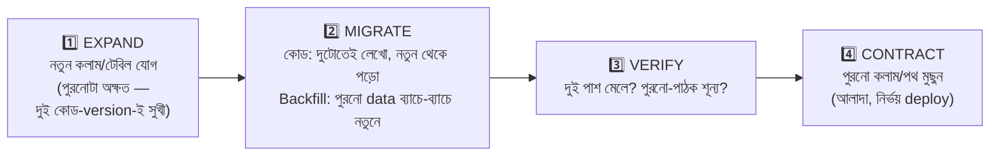

# Day 53 — Zero-Downtime Schema Migration

## 🎯 সমস্যা

টেবিলে কলাম-বদল দরকার — কিন্তু app ২৪/৭ চলছে, আর deploy-মুহূর্তে **দুই version-এর কোড একসাথে জীবিত** (rolling-deploy-এ পুরনো pod-রা তখনো traffic নিচ্ছে!)। "কলামের নাম বদলাই + কোড বদলাই — এক deploy-এ" — মাঝের সেকেন্ডগুলোতেই পুরনো-কোড-নতুন-schema বা নতুন-কোড-পুরনো-schema — crash। আর দ্বিতীয় দানব: বড় টেবিলে কিছু DDL **lock** ধরে — লাখো-row-র টেবিলে ভুল `ALTER` মানে মিনিট-ধরে সব লেখা স্থবির। Zero-downtime migration তাই এক বাক্যে: **schema আর কোড কখনো এক লাফে নয় — সবসময় সহাবস্থান-যোগ্য ছোট ধাপে।**

## 🖼️ Expand–Migrate–Contract

## 💡 নিয়মগুলো

**1. মূল ছন্দ: expand → migrate → contract — প্রতিটা ধাপ নিজে-নিজে নিরাপদ।** কলাম-নাম-বদলের উদাহরণে: (ক) নতুন কলাম যোগ (nullable — পুরনো কোড টেরও পায় না); (খ) কোড-deploy: **দুটোতেই লেখে**, পুরনো থেকে পড়ে; (গ) backfill-এ ইতিহাস ভরুন; (ঘ) কোড-deploy: নতুন থেকে পড়ে (লেখা এখনো দুটোতেই — ফেরার পথ খোলা!); (ঙ) ক'দিন পরে: পুরনো-লেখা বন্ধ; (চ) সবশেষে পুরনো কলাম drop। ছয় ছোট ধাপ, প্রতিটাতে rollback = আগের ধাপে ফেরা — Day 14-এর canary-দর্শন schema-য়, আর Day 52-র expand-contract-এর data-রূপ। হ্যাঁ, এক-লাইনের বদলে ছয়-ধাপ — **এটাই দাম, আর এ দাম downtime-এর চেয়ে সস্তা।**

**2. দুটোতে-লেখার শৃঙ্খলা:** dual-write app-কোডে করলে ভুলে-যাওয়া-পথ (কোনো পুরনো batch-job শুধু পুরনোতে লিখছে!) — বিকল্প/সহায়ক: DB-trigger দিয়ে sync (সব লেখা-পথ এক জালে) বা CDC-ভিত্তিক copy (Day 22/47-এর যন্ত্র); যেটাই হোক, **verify-ধাপে দুই কলামের মিল-পরীক্ষা** (reconciliation-query) বাধ্যতামূলক — অমিল মানেই কোনো পথ ফাঁকি দিচ্ছে।

**3. Backfill — মিলিয়ন-row-র ভদ্রতা:** এক `UPDATE ... SET new = old` পুরো টেবিলে? — লক, replication-lag-বিস্ফোরণ (Day 19-এর lag এক লাফে সেকেন্ড→মিনিট!), WAL-বন্যা। নিয়ম: **ছোট ব্যাচে** (হাজার-ঘরানা, PK-ক্রমে — Day 24-এর keyset-হাঁটা), ব্যাচের ফাঁকে শ্বাস (throttle, replica-lag দেখে গতি-নিয়ন্ত্রণ), idempotent-লেখা (মাঝপথে মরলে আবার — Day 40-এর checkpoint-অভ্যাস), আর ব্যস্ত-সময় এড়িয়ে।

**4. Lock-জ্ঞান — কোন DDL নিরাপদ, কোনটা ফাঁদ (engine-ভেদে যাচাই করুন, ছবিটা এই):** নতুন nullable-কলাম যোগ — প্রায়-তাৎক্ষণিক; **default-সহ কলাম** — আধুনিক Postgres-এ metadata-only (নিরাপদ), পুরনো/অন্য-engine-এ টেবিল-পুনর্লিখন (ফাঁদ!); index-তৈরি — সাধারণ রূপ লক ধরে, তাই Postgres-এ `CREATE INDEX CONCURRENTLY` / SQL Server-এ `ONLINE=ON` (Day 12-র সেই পাঠ); `NOT NULL`/foreign-key যোগ — পূর্ণ-স্ক্যান-যাচাই লক ধরে, পথ: আগে `NOT VALID`-জাতীয় রূপে যোগ, পরে আলাদা ধাপে validate; type-বদল — প্রায়ই পুনর্লিখন = আসলে "নতুন কলাম + migrate"-ই করুন। আর মোক্ষম ছোট-অস্ত্র: **`lock_timeout`** — migration-স্ক্রিপ্টে সবসময়; লক না পেলে সে-ই মরুক (retry হবে), production-লেখা জিম্মি না হোক। MySQL-জগতে খুব-বড় টেবিলের ভারী-বদলে online-schema-change-tool-ঘরানা (ছায়া-টেবিল+sync+switch) — একই expand-contract, যন্ত্রে-মোড়া।

**5. প্রক্রিয়ার শৃঙ্খলা:** migration **version-করা, ক্রমিক, কোডের সাথে repo-তে** (migration-tool যেটাই হোক); **কোড-deploy আর schema-বদল আলাদা ধাপ** (schema আগে expand, কোড পরে — কখনো এক অণু-deploy-এ জোড়া নয়); প্রতিটা migration-এর **রোলব্যাক-ভাবনা লিখিত** (সব বদল উল্টানো যায় না — যেটা যায় না, সেটা জেনে-বুঝে, দুই-ধাপ-বেশি সাবধানে); আর **contract-ধাপ ভুলে যাওয়াই মহামারী** — দুটোতে-লেখা চিরকাল চললে জটিলতা+bug-এর স্থায়ী ভাড়া (Day 47-এর অর্ধেক-strangler-কবরস্থান, Day 14-এর flag-জঞ্জাল — একই রোগ); migration-টিকিট বন্ধ হয় পুরনো-কলাম-drop-এ, আগে নয়।

## ⚖️ সিদ্ধান্ত-ছক

| বদল | পথ |
|------|-----|
| নতুন nullable কলাম/টেবিল | সোজা expand — নিরাপদ |
| নাম/type/অর্থ-বদল | নতুন কলাম + dual-write + backfill + switch + drop |
| Index | Concurrent/online রূপে, lock_timeout-সহ |
| NOT NULL/constraint | দুই-ধাপ: NOT VALID-যোগ → পরে validate |
| দানব-টেবিলে ভারী-বদল | ছায়া-টেবিল/online-tool-ঘরানা |

## ⚠️ Common Mistakes

- "Staging-এ তো এক সেকেন্ডে হলো" — staging-এর ১০-হাজার row বনাম production-এর ১০-কোটি; **production-মাপের অনুশীলন** (restore-করা কপিতে মহড়া) ছাড়া বড়-migration ছাড়বেন না।
- Migration-এ app-এর ORM-auto-sync ভরসা — "মডেল বদলালেই সে ALTER চালায়" — কী ALTER, কোন লক, জানেনই না; migration হাতে-লেখা, পর্যালোচিত SQL।
- Backfill আর লাইভ-লেখার রেস — backfill পুরনো-মান বসাচ্ছে, লাইভ-লেখা নতুন — ক্রম-ভুলে নতুনটা মুছল; নিয়ম: backfill কেবল "নতুন-কলাম-এখনো-খালি" row ছোঁবে (idempotent+নিরাপদ)।
- Drop-এর দিন চমক — কোন লুকানো রিপোর্ট/ETL পুরনো কলাম পড়ছিল; drop-এর আগে ব্যবহার-খোঁজ (query-log/dependency-স্ক্যান) — Day 52-র sunset-মেট্রিকের DB-রূপ।

## 🎤 Interview Tip

মন্ত্রটা: **"Schema আর কোড কখনো এক লাফে নয় — expand-migrate-contract-এর ছয় ছোট ধাপ, প্রতিটা দুই-version-সহাবস্থানে নিরাপদ, প্রতিটার ফেরার পথ খোলা।"** তারপর দুটো বিশেষজ্ঞ-ছোঁয়া: **"বড় টেবিলে আমার দুই আতঙ্ক — লক আর replication-lag; তাই lock_timeout, concurrent-index, আর ব্যাচ-backfill lag-থার্মোমিটার দেখে।"** আর শেষ কথা: **"Migration শেষ হয় drop-এ — dual-write-এর স্থায়ী-সংসার আমি রাখি না।"**
