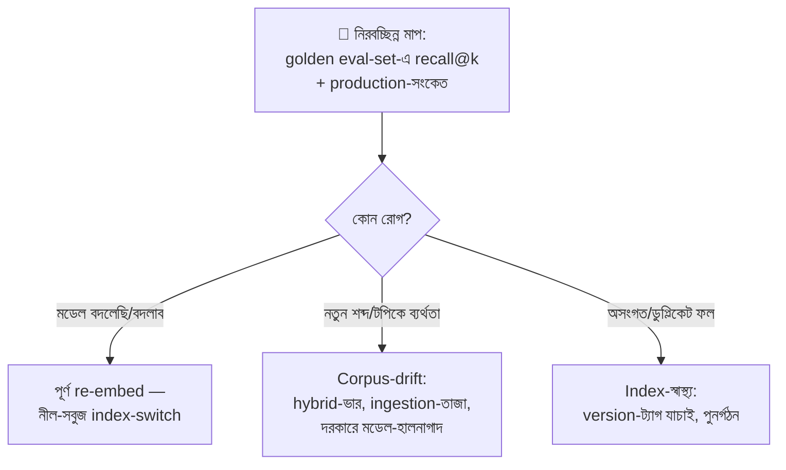

# Day 54 — RAG-এ Embedding Drift হ্যান্ডেল করা

## 🎯 সমস্যা

RAG চলছে মাস-ছয়েক — retrieval-মান নীরবে নামছে। "Drift" শব্দটার নিচে আসলে **তিনটা আলাদা রোগ**, আর তিনটার ওষুধ ভিন্ন: (১) **মডেল-বদলের অসামঞ্জস্য** — embedding-মডেল upgrade করলেন, নতুন query-vector পুরনো doc-vector-দের সাথে তুলনীয়ই নয় (দুই মডেলের space দুই ভিন্ন জগৎ); (২) **Corpus/query-drift** — ব্যবসা বদলেছে: নতুন পণ্য, নতুন শব্দভাণ্ডার, user-রা নতুন ঢঙে প্রশ্ন করছে — মডেল ঠিকই আছে, জগৎটা সরে গেছে (Day 50-এর সেই model-বুড়ো-হওয়া, retrieval-রূপে); (৩) **Index-ক্ষয়** — আধা-re-index, মোছা-না-হওয়া পুরনো chunk, দুই-মডেলের vector মিশে-যাওয়া (Day 27-এর সেই সাবধানবাণী বাস্তবে ঘটেছে)।

## 🖼️ রোগ-নির্ণয়ের কাঠামো

## 💡 ওষুধগুলো, রোগ ধরে

**1. প্রথম আইন: এক index-এ দুই মডেলের vector কখনো নয়।** প্রতিটা vector-এ **embedding-model-version metadata**, আর index/collection-নাম-এই version (`docs_v3_modelX`) — মিশ্রণ কাঠামোগতভাবেই অসম্ভব হোক। মডেল-বদল মানে **পূর্ণ re-embed** — আংশিক-উত্তরণ ("নতুন doc নতুন মডেলে, পুরনোগুলো পুরনোতে") মানে দুই-জগতের-তুলনা — retrieval-এর নীরব আত্মহত্যা।

**2. Re-embed-এর যন্ত্রটা প্রথম দিনেই বানান (Day 28-এর সাবধানবাণী এখন বিল হয়ে এসেছে):** কোটি-chunk re-embed = টাকা+সময় — তাই **নীল-সবুজ index-ছক** (Day 45-এর alias-switch-এর যমজ): পুরনো index serve করছে, পাশে নতুন-মডেলের index ভরছে (batch-এ, throttle-এ — Day 53-এর backfill-ভদ্রতা), **eval-set-এ দুটোর তুলনা** (নতুনটা সত্যিই ভালো তো? মডেল-upgrade মানেই retrieval-উন্নতি নয়!), তারপর alias-switch — আর ফেরার পথ খোলা। Query-embedding-ও ঠিক switch-মুহূর্তেই নতুন মডেলে — এ জোড়া-বদল atomic রাখতে alias-এর সাথে মডেল-config-ও এক জায়গায় বাঁধুন।

**3. Corpus/query-drift — মডেল ঠিক, জগৎ সরেছে:** লক্ষণ ধরা পড়ে **ব্যর্থ-প্রশ্নের ধারায়**: নতুন পণ্য-নাম, নতুন সংক্ষেপ, নতুন প্রশ্ন-ঢঙে recall পড়ছে। ওষুধের সিঁড়ি: (ক) **ingestion-তাজা তো?** — অনেক "drift" আসলে Day 27-এর বাসি-index (নতুন ডকুমেন্টই ঢোকেনি); (খ) **hybrid-এর keyword-পা** (Day 28/45) — নতুন নাম/কোড embedding-মডেলের অচেনা হলেও BM25 ঠিকই ধরে — hybrid এখানে drift-বিমা; (গ) domain-শব্দভাণ্ডার গভীরে সরলে — মডেল-হালনাগাদ/fine-tuned-embedding বিবেচনা — কিন্তু সেটা আবার নিয়ম-১-এর পূর্ণ-re-embed।

**4. মাপা — drift ধরা পড়ে যন্ত্রে, অনুভূতিতে নয় (Day 34-এর eval-ধর্ম, retrieval-এ):**
- **Golden-set:** প্রশ্ন→প্রত্যাশিত-chunk জোড়া, নিয়মিত (নৈশ/সাপ্তাহিক) recall@k/MRR — ধারাবাহিক পতন = সংকেত; আর set-টা **তাজা রাখুন** — নতুন-টপিকের প্রশ্ন যোগ না করলে eval নিজেই drift-অন্ধ;
- **Production-সংকেত:** retrieval-score-বিতরণের সরণ (শীর্ষ-ফলের গড়-similarity নামছে?), "কিছুই-পাইনি"-হার, answer-স্তরের feedback (thumbs-down-ঝাঁক কোন টপিকে), query-embedding-বিতরণের সরণ (নতুন-ঘরানার প্রশ্ন আসছে — corpus-এ উত্তর আছে তো?);
- এই সংকেতগুলোই Day 58-এর observability-গল্পের retrieval-অধ্যায়।

**5. আর chunk-স্তরের স্বাস্থ্যবিধি (নীরব-ক্ষয় রুখতে):** re-index-এ **delete-then-insert doc-ID ধরে** (Day 27-এর সেই নিয়ম — নাহলে এক ডকুমেন্টের তিন যুগের chunk পাশাপাশি), tombstone/মোছা-ডকুমেন্টের vector-ও মুছুন, আর ingestion-pipeline-এ content-hash — অবদল ডকুমেন্ট re-embed-এ টাকা পোড়াবেন না।

## ⚖️ সিদ্ধান্ত-ছক

| লক্ষণ | রোগ | ওষুধ |
|--------|------|------|
| মডেল-upgrade-এর পর ধস | Space-অসামঞ্জস্য | পূর্ণ re-embed, নীল-সবুজ switch |
| নতুন নাম/টপিকে ব্যর্থ | Corpus-drift | Ingestion-তাজা + hybrid-keyword + eval-হালনাগাদ |
| ডুপ্লিকেট/অসংগত ফল | Index-ক্ষয় | Version-ট্যাগ-নিরীক্ষা, doc-ID-ধরে পুনর্গঠন |
| ধীর, ব্যাপক পতন | মিশ্র | Golden-set-বিশ্লেষণে ভাগ করুন — অনুমানে ওষুধ নয় |

## ⚠️ Common Mistakes

- "নতুন embedding-মডেল ভালো, switch করি" — নিজের data-র eval ছাড়া; benchmark-জয়ী মডেল আপনার domain-এ হারতেই পারে (Day 28-এর সেই পাঠ)।
- Re-embed-খরচ নকশায় নেই — মডেল-বদল "কখনো লাগবে না" ধরে নেওয়া; লাগবেই — প্রশ্ন শুধু কবে, আর তখন যন্ত্র থাকবে কি না।
- Eval-set জন্ম থেকে জমাট — ছয়-মাস-আগের প্রশ্নে আজও ১০০% পেয়ে নিশ্চিন্ত, অথচ আজকের প্রশ্নে ব্যর্থ; production-ব্যর্থতা থেকে নিয়মিত নতুন-কেস eval-এ।
- সব দোষ embedding-এর — retrieval-ব্যর্থতার অর্ধেক chunking/ingestion/filter-এ (Day 27: আগে retrieval-debug); drift-তদন্তও সেই ক্রমেই।

## 🎤 Interview Tip

শুরুতেই রোগ-ভাগ: **"'Embedding drift' আসলে তিন রোগের এক নাম — মডেল-বদলের space-অসামঞ্জস্য (ওষুধ: version-ট্যাগ + নীল-সবুজ পূর্ণ-re-embed), জগৎ-সরে-যাওয়া corpus-drift (ওষুধ: তাজা-ingestion + hybrid + জীবন্ত eval), আর index-ক্ষয় (ওষুধ: স্বাস্থ্যবিধি)।"** তারপর এক লাইনের নীতি: **"এক index-এ দুই মডেলের vector — এটা কাঠামোগতভাবে অসম্ভব বানাই; আর re-embed-এর নীল-সবুজ যন্ত্রটা প্রথম দিনের নকশা, সংকটের রাতের নয়।"**
