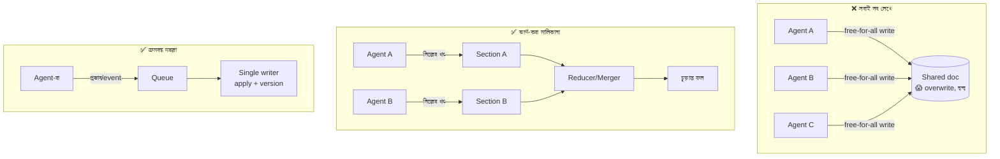

# Day 55 — Shared State-সহ Parallel Agents

## 🎯 সমস্যা

Day 29-এ ছিল orchestration-এর বড় ছবি; আজ তার সবচেয়ে কাঁটাওয়ালা কোণ: **একাধিক agent একসাথে চলছে, আর সবাই একই state ছুঁচ্ছে।** Research-agent-রা এক শেয়ার্ড নোটে লিখছে, দুই agent একই ticket আপডেট করছে, planner-এর task-list থেকে worker-রা কাজ তুলছে — চেনা গন্ধ পাচ্ছেন? এ তো Day 39-এর check-then-act, Day 06-এর lock, Day 07-এর ordering — **সব পুরনো concurrency-দানব, নতুন মোড়কে।** নতুনত্ব দুটো: agent-এর "read-think-write" চক্রটা সেকেন্ড-মিনিট লম্বা (রেসের জানালা বিশাল!), আর writer-রা non-deterministic — একই state দেখেও দু'বার দুই সিদ্ধান্ত।

## 🖼️ ছকগুলো

## 💡 নকশার সিঁড়ি — দ্বন্দ্ব এড়ানো > দ্বন্দ্ব মেটানো

**1. শ্রেষ্ঠ shared-state হলো যেটা shared-ই না: fan-out/fan-in।** কাজটা **স্বাধীন খণ্ডে ভাগ** করুন — প্রতি agent-এর নিজস্ব input, নিজস্ব output-জায়গা (কেউ কারো লেখা ছোঁয় না), শেষে এক **reducer-ধাপ** (কোড বা আরেক LLM-call) ফলগুলো জোড়ে। এটা Day 38-এর map-reduce-ই — agent-পোশাকে; আর ৮০% "parallel agents" সমস্যার সৎ উত্তর। Reducer-এ দ্বন্দ্ব-মীমাংসার নীতি লিখুন (দুই researcher পরস্পরবিরোধী তথ্য আনলে? — উৎস-র‍্যাঙ্ক/দুটোই-উল্লেখ/মানুষ) — জোড়ার ধাপটাই আসল বুদ্ধির জায়গা।

**2. State ছুঁতেই হলে — মালিকানা ভাগ করুন।** Shared-doc-কে খণ্ডে ভাঙুন, **প্রতি খণ্ডের এক মালিক-agent** (Day 07-এর partition-key-দর্শন: entity-প্রতি এক writer); অন্যরা পড়তে পারে, লিখতে নয়। "সবাই সব লেখে" নকশাটাই ভুল — LLM-এ তো বটেই, মানুষেও (Day 37-এর সেই শিক্ষা)।

**3. তবু এক জিনিসে বহু-লেখক লাগলে — Day 39-এর তালাগুলোই, agent-মাপে:**
- **Optimistic version-চেক — default:** agent state পড়ল version-সহ, ভেবে লিখতে এল — version বদলে গেছে? লেখা প্রত্যাখ্যান → agent **নতুন state পড়ে পুনর্বিবেচনা** করে (এটাই LLM-মোচড়: মানুষ-কোডে retry মানে একই লেখা আবার; agent-এ retry মানে *নতুন বাস্তবতায় নতুন সিদ্ধান্ত* — যা প্রায়ই সঠিক আচরণ)। লম্বা-জানালার জগতে pessimistic-lock ধরে-রাখা (মিনিট!) মানে সবাই দাঁড়িয়ে — optimistic-ই মানানসই।
- **Single-writer দরজা:** agent-রা সরাসরি লেখে না — **প্রস্তাব/event পাঠায়** queue-তে (Day 07-এর ক্রম), এক writer-প্রক্রিয়া apply করে (validation-সহ — Day 46-এর schema-চৌকি এখানেও)। রেস কাঠামো থেকেই বিলুপ্ত; audit-ও ফ্রি (কে কী প্রস্তাব করল — Day 33-এর event-গন্ধ)।
- **Append-only ভাগ-নোট:** overwrite-এর বদলে সবাই শুধু **যোগ** করে (timestamped entry) — দ্বন্দ্বের বদলে সহাবস্থান; পরে reducer/সারাংশ-ধাপ গুছিয়ে নেয় (Day 42-এর consolidation)।

**4. কাজ-বণ্টনের রেসটাও ভুলবেন না:** দুই worker-agent একই task তুলে নিলে — টাকা দুই-গুণ, ফল এলোমেলো। এ তো চেনা job-queue সমস্যা: **atomic claim** (`UPDATE tasks SET owner=me WHERE id=? AND owner IS NULL` — Day 39-এর conditional-write; বা queue-র visibility-lease — Day 25/40), lease-মেয়াদ + heartbeat (agent-এর "ভাবনা" লম্বা — মাঝে মরলে কাজ ফেরত আসুক), আর tool-side-effect-এ idempotency (Day 04/48 — claim-রেস যদি গলেও যায়, ক্ষতিটা যেন না ঘটে)।

**5. Parallelism-এর LLM-বাস্তবতা:** সমান্তরাল মানে টাকাও সমান্তরাল — **fan-out-বাজেট** (সর্বোচ্চ N শাখা, প্রতি শাখার token-সীমা — Day 29-এর guard); rate-limit-ও ভাগ হয় (৫ agent × ঘন call = provider-এর 429 — Day 03-এর client-পাশ); আর শাখাগুলোর ফল আসবে **এলোমেলো ক্রমে ও অসমান মানে** — reducer-কে আংশিক-ব্যর্থতা সইতে হবে (৩টা শাখা সফল, ১টা timeout → ৩টা দিয়েই এগোও, ফাঁক উল্লেখ করো — Day 20-এর degrade-দর্শন)।

## ⚖️ সিদ্ধান্ত-ছক

| পরিস্থিতি | ছক |
|-----------|-----|
| খণ্ডযোগ্য কাজ | Fan-out/fan-in + reducer — প্রথম পছন্দ |
| ভাগযোগ্য state | খণ্ড-মালিকানা (এক খণ্ড, এক লেখক) |
| এক জিনিসে বহু-লেখক | Optimistic version → পুনর্বিবেচনা-লুপ |
| কঠোর ক্রম/audit দরকার | প্রস্তাব-queue + single-writer |
| কাজ-তোলা | Atomic claim + lease + idempotent effect |

## ⚠️ Common Mistakes

- Shared state হিসেবে "সবার context-এ সব ঢালা" — state আর prompt গুলিয়ে ফেলা; state থাকে durable store-এ (Day 29), agent পড়ে দরকারি টুকরো (Day 42)।
- Version-conflict-এ অন্ধ-retry (একই লেখা আবার ঠেলা) — LLM-agent-এর সঠিক আচরণ পুনঃ-পাঠ-পুনঃ-ভাবনা; এ পার্থক্যটা orchestration-কোডে স্পষ্ট করুন।
- দ্বন্দ্ব-মীমাংসা LLM-এর বিবেকে ছাড়া — "agent-রা আলোচনা করে ঠিক করুক" (Day 29-এর সেই লাল-পতাকা); মীমাংসার নিয়ম নকশায় — কোড-যাচাই, উৎস-র‍্যাঙ্ক, মানুষ-lane।
- আংশিক-ব্যর্থতায় সব-বাতিল — এক শাখার timeout-এ পুরো fan-out ফেলে আবার শুরু = টাকা-পোড়ানো; শাখা-স্তরে retry, reducer-স্তরে সহনশীলতা।

## 🎤 Interview Tip

শিকড়টা ধরিয়ে দিন: **"Parallel agents-এর shared-state মানে পুরনো concurrency — check-then-act, single-writer, atomic-claim — শুধু রেসের জানালা সেকেন্ড-মিনিট আর writer-রা non-deterministic।"** তারপর সিঁড়ি: **"তাই প্রথমে দ্বন্দ্ব এড়াই (fan-out + মালিকানা-ভাগ), তারপর optimistic-version — আর conflict মানে agent-এর জন্য retry নয়, পুনর্বিবেচনা।"** এই শেষ পার্থক্যটাই — retry বনাম re-think — এ টপিকের সবচেয়ে দামি এক-লাইন।
