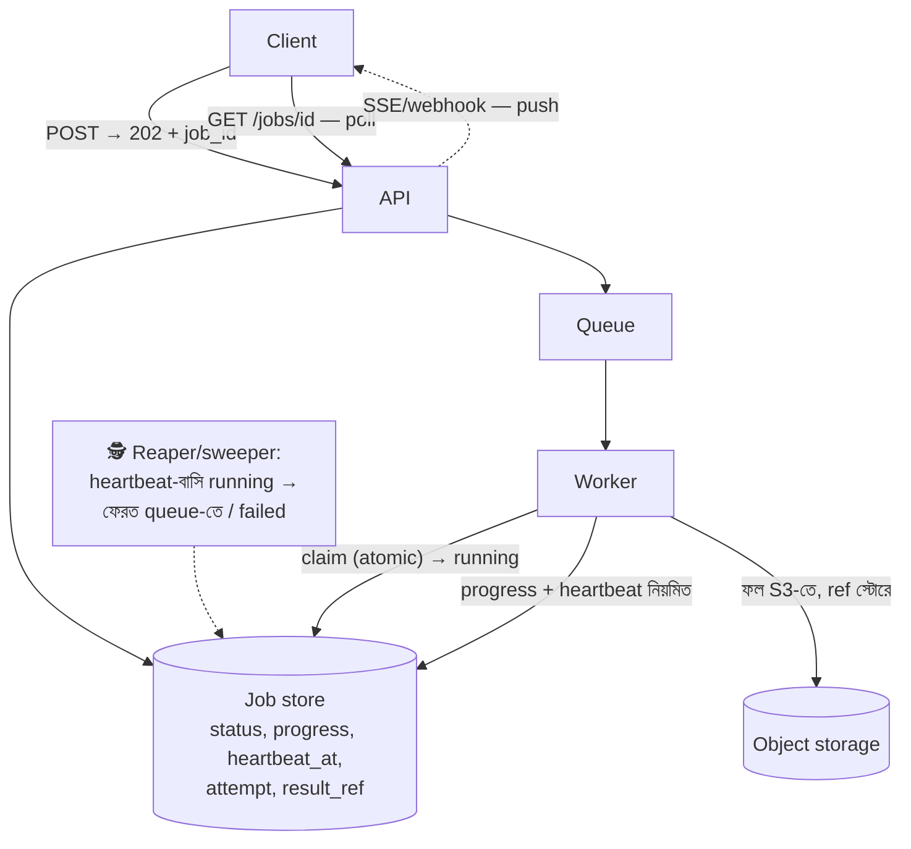

# Day 56 — Long-Running Async Job Tracking

## 🎯 সমস্যা

Day 40-এ কাজটা queue-তে পাঠিয়ে 202+job_id দিয়েছিলাম — আজ তার পরের অধ্যায়: **সেই job-এর জীবনটা কে দেখে রাখে?** Video-transcode ২০ মিনিট, data-export ২ ঘণ্টা, ML-training সারারাত — এর মধ্যে user জিজ্ঞেস করছে "কতদূর?", support জিজ্ঞেস করছে "আটকে আছে কেন?", আর system-কে জানতে হবে "এটা কি সত্যিই চলছে, নাকি worker-টা মরে গেছে আর কেউ টের পায়নি?" শেষ প্রশ্নটাই সবচেয়ে ধারালো: **ধীরে-চলা আর মরে-যাওয়া বাইরে থেকে একই রকম দেখায়** — তফাত করার যন্ত্রই এ নকশার হৃৎপিণ্ড।

## 🖼️ কাঠামোটা

## 💡 নকশার টুকরোগুলো

**1. Job store — truth-এর এক ঘর।** প্রতিটা job এক row: `job_id, type, status, progress, attempt, created/started/heartbeat_at, result_ref, error`। **Status-গুলো একটা state-machine** — `queued → running → succeeded | failed | canceled` — আর প্রতিটা transition **atomic + বৈধতা-চেক** (`UPDATE ... WHERE status='queued'` — Day 39-এর conditional-write; `running`-থেকে-`queued`-এ ফেরা শুধু reaper-এর হাতে)। এলোমেলো status-লেখা = ভূতুড়ে job-এর জন্ম।

**2. মরা-বনাম-ধীর: heartbeat + reaper — এ নকশার আসল উত্তর।** Worker কাজ চলাকালে **নিয়মিত heartbeat_at ঠেলে** (প্রতি ৩০-সেকেন্ড-ঘরানা); এক **sweeper/reaper** ঘুরে দেখে: `running` অথচ heartbeat বাসি → worker মৃত ধরে নাও → attempt+1 করে **queue-তে ফেরত** (সীমা পেরোলে `failed` + alert)। এটাই Day 25-এর visibility-timeout-এর হাতে-বানানো রূপ — queue-ব্যবস্থা যেটা দেয়, job-store-স্তরেও সেটা লাগবে, কারণ ২-ঘণ্টার কাজে queue-র lease এমনিতেই heartbeat-নবায়নে বাঁচে (Day 40)। আর ফেরত-যাওয়া job আবার চলবে — তাই worker **idempotent + checkpoint-অভ্যাসী** (Day 40/44: ৬০০০-তম রেকর্ড থেকে ধরুক, শূন্য থেকে নয়; checkpoint-টাও job-store-এই)।

**3. Progress — সৎ থাকুন।** তিন স্তরের সততা: **গণনাযোগ্য** কাজে সত্যি-শতাংশ (processed/total), **ধাপ-ওয়ালা** কাজে ধাপ-নাম ("transcoding 3/5: audio mixing"), আর **অগণনীয়** কাজে ভান করবেন না — "চলছে, শুরু হয়েছে X মিনিট আগে, সাধারণত লাগে Y" (ঐতিহাসিক গড় — job-type-প্রতি duration-পরিসংখ্যান রাখলেই পাওয়া যায়, আর সেটা reaper-এর "বাসি"-সংজ্ঞা আর alert-থ্রেশহোল্ডেও কাজে লাগে)। ভুয়া-progress-bar আস্থা খায়; "৯৯%-এ ২০ মিনিট ঝুলে-থাকা" তার কুখ্যাত রূপ।

**4. Client-কে জানানো — Day 40-এর চুক্তির বিস্তার:** ভিত্তি **poll** (`GET /jobs/{id}` — সরল, cache-যোগ্য, backoff-সহ); UI-খোলা-থাকা ক্ষেত্রে **SSE/WebSocket-এ push** (Day 21 — progress-stream); server-to-server ভোক্তায় **webhook** (আর আপনি এখন webhook-*প্রেরক* — Day 11-এর উল্টো পিঠ: event-ID দিন, retry করুন, গ্রাহককে idempotent হতে দিন)। ফল বড় হলে result_ref = presigned-URL (Day 30); আর status-endpoint-এ **অনুমতি-চেক ভুলবেন না** — job_id অনুমানযোগ্য হলে অন্যের export-ফাইলের দরজা (UUID + মালিকানা-যাচাই, দুটোই)।

**5. Cancel আর জীবনচক্র:** cancel মানে **অনুরোধ**, তাৎক্ষণিক মৃত্যু নয় — store-এ `cancel_requested` পতাকা, worker checkpoint-বিরতিতে দেখে ভদ্রভাবে থামে (আধা-লেখা ফল পরিষ্কার করে `canceled`-এ যায়); জোর-খুন শেষ অস্ত্র। আর job-row-রা জমে পাহাড় হয় — মেয়াদ-নীতি: সফল-job N-দিনে আর্কাইভ/মুছুন (Day 22-এর outbox-পরিচ্ছন্নতার জ্ঞাতি), ব্যর্থ-গুলো একটু বেশিদিন (তদন্তের স্বার্থে), মেট্রিক-সারাংশ থাক চিরকাল।

**6. বহু-ধাপ workflow হলে:** transcode→thumbnail→notify — এ আর এক job নয়, job-শৃঙ্খল; হাতে-বোনা status-জোড়া জটিল হয়ে উঠলে সেটাই সংকেত — Day 10/29-এর orchestration/durable-execution-ঘরানায় ওঠার সময় (Temporal-জাতীয় engine এই heartbeat-reaper-checkpoint সংসারটাই built-in দেয়)।

## ⚖️ সিদ্ধান্ত-ছক

| প্রশ্ন | উত্তর |
|--------|-------|
| Truth কোথায় | Job-store-এর state-machine, atomic-transition |
| মরা-ধরা | Heartbeat + reaper → re-queue (সীমাসহ) |
| Progress | সত্য-শতাংশ / ধাপ-নাম / সৎ "চলছে+ঐতিহাসিক-গড়" |
| জানানো | Poll ভিত্তি; UI-তে SSE, server-এ webhook |
| ফল | Object-storage + presigned-ref |
| বহু-ধাপ | Workflow-engine-এ উত্তরণের সংকেত |

## ⚠️ Common Mistakes

- Status শুধু queue-র ভরসায় — queue বলে "message আছে/নেই", user-এর প্রশ্ন "আমার কাজটার কী হলো" — দুটো ভিন্ন প্রশ্ন; job-store লাগবেই।
- Heartbeat আছে, reaper নেই — heartbeat কেউ না দেখলে সেটা ডায়েরি, পাহারা নয়; sweeper + "বাসি-running" alert জোড়া-জিনিস।
- Retry-তে attempt-সীমা/poison-নীতি নেই — একই ভাঙা-job অনন্ত re-queue (Day 25-এর DLQ-পাঠ); N-বারে failed + মানুষ-lane।
- API-তে sync-অভ্যাসের ভূত — "ছোট কাজ তো, ৩০-সেকেন্ড ধরে রাখি" — Day 40-এ ফিরুন; সীমা-অজানা কাজ মানেই async-চুক্তি।

## 🎤 Interview Tip

হৃৎপিণ্ডটা প্রথমে: **"লম্বা-job-এর কঠিনতম প্রশ্ন — ধীর না মৃত? উত্তর heartbeat+reaper: worker স্পন্দন পাঠায়, sweeper বাসি-running-দের re-queue করে, attempt-সীমা আর idempotent-checkpoint-ওয়ালা worker সেটাকে নিরাপদ করে।"** তারপর চুক্তি-পাশ: state-machine-ওয়ালা job-store, সৎ-progress, poll-ভিত্তি+push-উন্নতি, presigned-ফল। শেষে উত্তরণ-জ্ঞান: **"Job-শৃঙ্খল জটিল হলে এ সংসার হাতে না বুনে durable-execution-engine — চাকাটা ওখানে উড়োজাহাজ।"**
