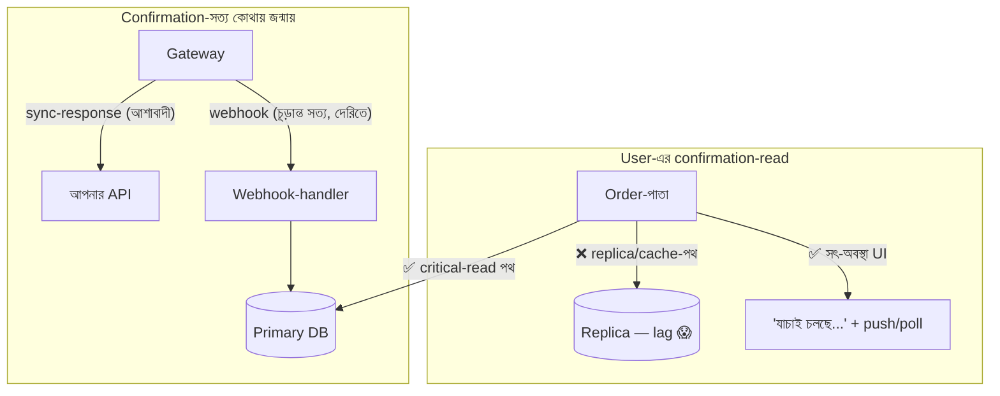

# Day 57 — Payment-Confirmation Read-এর Consistency

## 🎯 সমস্যা

User "Pay" চাপল → gateway সফল বলল → redirect হয়ে অর্ডার-পাতায় এল — আর দেখল **"Payment pending"**। আতঙ্ক, refresh-ঝড়, support-টিকিট, কখনো দ্বিতীয়বার-pay-এর চেষ্টা (Day 04-এর দানব জেগে ওঠে)। কারিগরি দিক থেকে ঘটেছে নিরীহ জিনিস: টাকা ঠিকই ধরা পড়েছে, কিন্তু user-এর read গেল **এমন পথে যেটা এখনো জানে না** — replica-lag (Day 19), cache-বাসি (Day 08), কিংবা আসল সত্যটা webhook-এ আসবে বলে এখনো পথেই (Day 11)। এ টপিকের মর্ম: **সব read সমান নয় — টাকার-নিশ্চয়তার read-এর জন্য আলাদা, কঠোরতর পথ লাগে।**

## 🖼️ সমস্যার শারীরস্থান + পথ

## 💡 স্তরে স্তরে

**1. আগে সত্যের জন্ম-প্রক্রিয়াটা মানুন: payment-status মূলগতভাবে async।** Gateway-র sync-response আশাব্যঞ্জক-সংকেত; **চূড়ান্ত রায় webhook-এ** (এবং reconciliation-এ)। অতএব "confirmation-read"-এর দুটো অর্থ: (ক) *আমাদের-জানা-সর্বশেষ-অবস্থা* — এটা দ্রুত দেখানো যায়; (খ) *চূড়ান্ত-সত্য* — এটা কয়েক সেকেন্ড দেরিতে আসতেই পারে। **UI-চুক্তিটা এ পার্থক্য মেনেই লিখুন:** "Payment received — verifying" একটা সৎ, প্রথম-শ্রেণির অবস্থা; ভুয়া-"success" বা আতঙ্ক-জাগানো-"pending" — দুটোই নকশা-ব্যর্থতা। State-machine-এ (Day 56-এর সেই শৃঙ্খলা) `authorized → captured → settled` — কোন ধাপে user-কে কী শব্দ দেখাবেন, সেটাই অর্ধেক সমাধান।

**2. Critical-read-এর রাস্তা আলাদা করুন — Day 19-এর অস্ত্র, ধারালো সংস্করণে।** সাধারণ পাতা replica-পড়ুক; কিন্তু **payment/order-confirmation-পথ**: (ক) সোজা **primary-তে** (এ endpoint-এর ভার ছোট — সদ্য-pay-করা user-রাই কেবল), (খ) কিংবা LSN/GTID-চেক ("আমার লেখা পৌঁছেছে?" — Day 19-এর নিখুঁত-পথ), (গ) আর **এ পথে cache নেই** — টাকার-অবস্থা cache-যোগ্য জিনিসই নয় (রাখতেই হলে event-চালিত-invalidation + সেকেন্ড-TTL — Day 26-এর কড়া রূপ, কিন্তু সরল উত্তর: রাখবেন না)। Payment-লেখা আর confirmation-পড়া **একই store-এর সত্যে** বাঁধুন — লেখা এক ঘরে, পড়া আরেক derived-ঘরে (search-index/read-model — Day 09/45) হলে ল্যাগ-নাটক অনিবার্য; derived-ঘর তালিকা-পাতার জন্য, নিশ্চয়তা-পাতার জন্য নয়।

**3. Redirect-মুহূর্তের ফাঁক — race-টা নকশায় ধরুন।** Gateway-redirect প্রায়ই webhook-এর *আগে* পৌঁছায় — user হাজির, সত্য এখনো পথে। পথগুলো একসাথে ব্যবহার্য: (ক) redirect-এ থাকা reference দিয়ে **সরাসরি gateway-API-তে synchronous-যাচাই** (webhook-এর অপেক্ষা না করে সত্য টেনে আনা — Day 11-এর "payload নয়, re-fetch"-নীতির জ্ঞাতি); (খ) পাতাটা **live-অবস্থা**: SSE/ছোট-poll (Day 21/56) — "verifying" থেকে "confirmed"-এ নিজে-নিজে বদলাক, user-কে refresh-জুয়া খেলতে না হোক; (গ) দুই-উৎসের (redirect-যাচাই + webhook) লেখা যেন সংঘর্ষ না বাঁধায় — দুটোই **idempotent, state-machine-বৈধ transition** (Day 39-এর conditional-write: `WHERE status='pending'` — পেছনে-হাঁটা transition কাঠামোতেই অসম্ভব)।

**4. দ্বিতীয়-চার্জের দরজাগুলো বন্ধ তো?** Confirmation-অনিশ্চয়তার সবচেয়ে দামি ক্ষতি user-এর পুনঃ-চেষ্টা — তাই এ পাতার "Pay again"-বোতাম অবস্থা-সচেতন (pending-এ নিষ্ক্রিয়+ব্যাখ্যা), আর নিচে Day 04/59-এর idempotency-জাল তো আছেই — UI-স্তরের সততা আর API-স্তরের জাল, দুটোই লাগে, একটাও যথেষ্ট নয়।

**5. শেষ স্তর: reconciliation — যখন webhook-ও হারায়।** Webhook আসেইনি (Day 11-এর সব সতর্কতার পরেও)? — নিয়মিত **sweep**: N-মিনিটের-বেশি-pending লেনদেনগুলো gateway-API-তে যাচাই (Day 30/56-এর reconciliation-অভ্যাসের টাকার-রূপ), অমিল → সংশোধন+alert। এ যন্ত্রটাই "চিরকাল-pending" ভূতের একমাত্র নিশ্চিত ওঝা — আর দিনশেষের হিসাব-মিলও (settlement-ফাইল বনাম নিজের খাতা — Day 33-এর ledger থাকলে এ কাজ আনন্দ) fintech-এর প্রাত্যহিক ধর্ম।

## ⚖️ সিদ্ধান্ত-ছক

| Read | পথ |
|------|-----|
| সদ্য-pay-করা user-এর confirmation | Primary/LSN-চেক, cache-হীন, live-আপডেট পাতা |
| Order-তালিকা/ইতিহাস | Replica/read-model — ল্যাগ মেনে |
| Redirect-মুহূর্ত | Gateway-তে sync-যাচাই + "verifying"-অবস্থা |
| Webhook-নিখোঁজ | Pending-sweep reconciliation |
| Status-লেখা (সব উৎস) | Idempotent, state-machine-বৈধ, conditional |

## ⚠️ Common Mistakes

- "Pending" শব্দটা user-কে কাঁচা দেখানো — কারিগরি-অবস্থা আর মানুষ-ভাষা এক নয়; "টাকা পেয়েছি, যাচাই চলছে — কিছু করতে হবে না" লেখাটাই অর্ধেক support-টিকিট মোছে।
- Confirmation-পাতা CDN/response-cache-এর পেছনে — এক user-এর "success" আরেকজনকে দেখানোর দুর্ঘটনা-গল্পগুলো এখান থেকেই; টাকার-পাতা `no-store` (Day 43-এর ব্যাকরণ)।
- Webhook-কে একমাত্র-পথ ধরা — redirect-যাচাই আর sweep না থাকলে এক হারানো-webhook = এক আতঙ্কিত-গ্রাহক।
- সব read primary-তে ঠেলে "সমাধান" — Day 19-এর সেই ভুল; কঠোর-পথ শুধু কঠোর-প্রশ্নের জন্য — নাহলে replica-র অর্থই গেল।

## 🎤 Interview Tip

শুরুতেই শ্রেণিভাগ: **"Payment-confirmation হলো read-consistency-র VIP-লেন — সব read সমান নয়; এ পথে replica-ল্যাগ আর cache-বাসি ঢুকতেই পারবে না: primary/LSN-পড়া, cache-হীন, আর UI-তে সৎ 'verifying'-অবস্থা যেটা live-বদলায়।"** তারপর গভীরতা: **"সত্যটা জন্মায় async (webhook) — তাই redirect-race-এ gateway-যাচাই, সব-লেখা idempotent-state-machine-এ, আর নিচে pending-sweep reconciliation — হারানো-webhook-এর বিমা।"** "Pending নয়, verifying" — এই শব্দ-সচেতনতাই fintech-UX বোঝার স্বাক্ষর।
