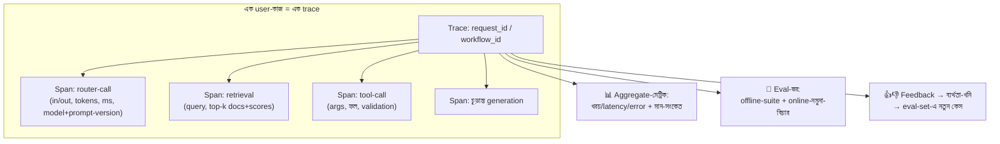

# Day 58 — LLM Agent Pipeline-এর Observability

## 🎯 সমস্যা

সাধারণ service-এ observability মানে: error-rate, latency, trace — ভাঙলে stack-trace বলে দেয় কোথায়। LLM-pipeline-এ নতুন যন্ত্রণা: **কিছুই "ভাঙে না", তবু ফল খারাপ** — উত্তর ভুল/জঞ্জাল/অর্ধেক, HTTP-status সবুজ। Non-determinism-এ "reproduce করো" প্রায় অর্থহীন, এক user-প্রশ্নের পেছনে ৭টা মডেল-call + ৪টা tool-call + ২টা retrieval — কোন ধাপে গলদ? আর মিটার ঘুরছে টাকায় — প্রতি ধাপ token পোড়ায়। মোদ্দা কথা: **LLM-observability = চিরাচরিত tracing + মান-মাপা (eval) + খরচ-মাপা — তিনটা একসাথে।**

## 🖼️ কাঠামোটা

## 💡 স্তরগুলো

**1. ভিত: প্রতিটা ধাপ trace-এ, এক ছাতার নিচে।** এক user-কাজ = এক trace-ID (Day 29-এর workflow-ID); প্রতিটা মডেল-call/retrieval/tool-call একটা span — সাথে **input-output (বা তার ref), token-সংখ্যা, latency, model-নাম, আর prompt-version**। শেষেরটা বেশির ভাগ দল ভোলে: prompt-ও কোড — version-করা থাকলে তবেই "কবে থেকে খারাপ হলো"-র উত্তরে "ঐ prompt-বদলের পর থেকে" বলা যায় (Day 34/46-এর সেই শৃঙ্খলা)। বড় payload trace-এ নয় — object-storage-এ, span-এ ref (Day 30); আর **PII-নীতি প্রথম দিনেই**: user-এর কথা log-এ যাচ্ছে — masking/মেয়াদ/প্রবেশ-নিয়ন্ত্রণ (Day 32-এর log-ও-secret-store পাঠ)।

**2. মেট্রিকের তিন পরিবার:** (ক) **চিরাচরিত** — ধাপ-প্রতি latency (p99!), error/timeout, retry-হার, repair-loop-হার (Day 46 — validation-fail কত ঘন?); (খ) **টাকা** — token/call → খরচ-প্রতি-কাজ, ভাগে-ভাগে (কোন ধাপ, কোন feature, কোন tenant — Day 51-এর metering!); "গড়-খরচ ৩ টাকা কিন্তু p99-খরচ ৯০ টাকা" — লেজটাই প্রায়ই গল্প (কোনো agent-loop ঘুরছে — Day 29-এর budget-guard-এর তথ্যসূত্র এ মেট্রিকই); (গ) **মান-সংকেত** — সরাসরি "সঠিকতা" মাপা যায় না, proxy যায়: retrieval-score-বিতরণ আর শূন্য-ফল-হার (Day 54-এর drift-থার্মোমিটার), tool-বাছাই-ভুলের হার (Day 48-এর মেট্রিক), refusal/fallback-হার, উত্তর-দৈর্ঘ্যের হঠাৎ-সরণ, আর user-signal (thumbs, পুনঃ-প্রশ্নের হার — user একই কথা ঘুরিয়ে জিজ্ঞেস করছে মানে প্রথম উত্তর ব্যর্থ)।

**3. মান-মাপার আসল যন্ত্র: eval — offline আর online দুই পায়ে।** **Offline:** golden-set regression (Day 34/54) — প্রতিটা prompt/model/retrieval-বদল ছাড়ার আগে suite (এটা CI — Day 14-এর canary-দর্শন প্রম্পটে); **Online:** production-নমুনার উপর **LLM-as-judge** (সস্তা-মডেল বিচারক: "উত্তরটা প্রশ্নের জবাব দেয়? উৎসের সাথে সঙ্গত?") — নিখুঁত নয়, কিন্তু **প্রবণতা** ধরে (গতকাল ৯২% আজ ৭৪% — কিছু ভেঙেছে); judge-কে মাঝে মাঝে মানুষ-নমুনায় calibrate করুন, আর judge-এর নিজের prompt-ও version-এ (বিচারক বদলালে রায়ের স্কেলও বদলায়!)।

**4. Alert — কীসে ঘুম ভাঙবে:** খরচ-স্পাইক (বাজেট-সীমার আগেই ঢাল-হার দেখে), error/repair-হারের লাফ, judge-স্কোরের ধারাবাহিক পতন, retrieval-শূন্যতার ঊর্ধ্বগতি, আর **নীরবতম বিপদ — provider-এর নীরব মডেল-হালনাগাদ**: আপনার কিছু না বদলেও আচরণ বদলায়; নৈশ-canary (স্থির-প্রশ্নের ছোট-set প্রতিরাতে চালিয়ে ফল-তুলনা) এ ভূতের একমাত্র জাল।

**5. Debug-লুপটা বন্ধ করুন — observability যেন খনিও হয়:** খারাপ-ফলের trace ধরে ধাপে-ধাপে হাঁটা (retrieval ঠিক ছিল? → tool-args? → generation?) — এ workflow-এর জন্য **trace-viewer-এ in/out পড়া-যায়** এমন tooling অমূল্য (LangSmith/Langfuse-ঘরানা, বা OpenTelemetry-ভিত্তিতে নিজেরটা); আর প্রতিটা নিশ্চিত-ব্যর্থতা → **eval-set-এ নতুন কেস** (Day 34-এর সেই চক্র: production-ব্যর্থতা আজকের bug, কালকের regression-test)। Feedback→triage→eval→fix→regression — এই চাকাটাই LLM-মানের একমাত্র টেকসই ইঞ্জিন।

## ⚖️ সিদ্ধান্ত-ছক

| প্রশ্ন | যন্ত্র |
|--------|--------|
| "কোন ধাপে গলদ?" | Trace + span (in/out-ref, version-ট্যাগ) |
| "খারাপ হচ্ছে কি?" | Judge-নমুনা + proxy-মেট্রিক + user-signal |
| "এ বদল ছাড়া নিরাপদ?" | Offline golden-suite (CI-তে) |
| "টাকা কোথায় যাচ্ছে?" | ধাপ/feature/tenant-ভাগ token-মেট্রিক |
| "Provider চুপচাপ বদলাল?" | নৈশ-canary স্থির-set |

## ⚠️ Common Mistakes

- শুধু চূড়ান্ত-উত্তর log করা — মাঝের ধাপ-হীন trace মানে "খারাপ উত্তর" জানা যায়, "কেন" কোনোদিন না।
- Judge-কে সত্য ভাবা — সে থার্মোমিটার, রায়-আদালত নয়; প্রবণতা তার কাজ, চূড়ান্ত-মান মানুষ-calibration-এর।
- Prompt-বদল version-হীন — "কিছুই তো deploy করিনি" অথচ কেউ প্রম্পট-কনসোলে এক লাইন ঘষেছে; prompt = কোড = version + review।
- খরচ-মেট্রিক মাস-শেষের বিলে প্রথম-দর্শন — Day 49-এর আয়না-নীতি: প্রতি-কাজ-খরচ dashboard-এ আজই, বিলে-চমক নয়।

## 🎤 Interview Tip

সংজ্ঞা দিয়ে খুলুন: **"LLM-observability-র নতুনত্ব: ব্যর্থতা এখানে exception নয়, নিম্নমান — তাই চিরাচরিত trace/metric-এর উপর দুটো নতুন তলা: মান-মাপা (offline golden-suite + online LLM-judge-নমুনা) আর টাকা-মাপা (ধাপ-ভাগ token)।"** তারপর দুই ধারালো-ছোঁয়া: **"Prompt-ও version-করা deploy — নাহলে 'কবে থেকে খারাপ' প্রশ্নটাই অনুত্তর"**, আর **"প্রতিটা production-ব্যর্থতা eval-set-এ ঢোকে — debug আর regression-বিমা এক চক্রে।"**
