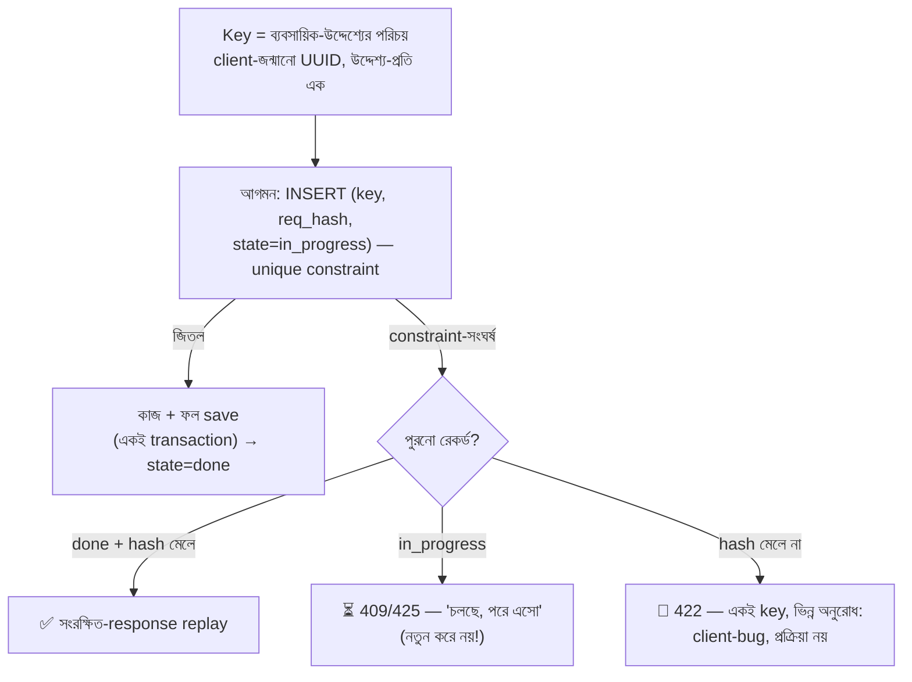

# Day 59 — Payment-এর জন্য Idempotency Key ডিজাইন

## 🎯 সমস্যা

Day 04-এ ছিল যন্ত্রটা (key দাও, dedupe করো); আজ প্রকৌশলীর আসল প্রশ্নগুলো — যেগুলোর ভুল উত্তরে যন্ত্রটাই বিষ হয়: **key-টা ঠিক কীসের পরিচয়?** (request-এর, না ব্যবসায়িক-উদ্দেশ্যের?), **কে বানাবে, কোন উপাদানে?**, **একই key ভিন্ন payload এলে?**, **কতদিন মনে রাখব?**, **concurrent-দুটো এলে দ্বিতীয়জন কী পাবে?** — payment-idempotency-র ৮০% bug এই নকশা-স্তরের, storage-স্তরের নয়।

## 🖼️ Key-র জীবনচক্র

## 💡 নকশা-সিদ্ধান্তগুলো, একে একে

**1. Key কীসের নাম? — উদ্দেশ্যের, request-এর নয়।** সবচেয়ে গভীর সিদ্ধান্ত: key জন্মায় **"user এই order-টার টাকা দিতে চাইল" — এই ব্যবসায়িক-মুহূর্তে**, HTTP-request বানানোর মুহূর্তে নয়। তাই: এক উদ্দেশ্যের সব retry (নেটওয়ার্ক-retry, user-এর দ্বিতীয়-ক্লিক, app-restart-পরের পুনঃচেষ্টা) — **একই key** (client সেটা টিকিয়ে রাখে — form-state/localStorage/app-DB-তে, Day 44-এর op-log-ভাবনা); আর user সত্যিই *নতুন* সিদ্ধান্ত নিলে (ব্যর্থ-payment-এর পরে "আবার চেষ্টা"-বোতাম, নতুন চেষ্টা হিসেবে) — **নতুন key**। এ সীমারেখা product-সংজ্ঞা, প্রকৌশল একা টানতে পারে না — "retry" আর "নতুন-চেষ্টা" UI-তে আলাদা জিনিস হোক।

**2. উপাদান: এলোমেলো, না গঠিত?** দুই ঘরানা: (ক) **client-জন্মানো UUID** — সরল, সর্বজনীন, gateway-রাও (Stripe-ঘরানা) এটাই চায়; (খ) **গঠিত/deterministic key** (`order_42:capture:attempt_1`) — retry-source যেখানে state-হীন (cron, event-consumer — Day 11/22-এর consumer-রা event-ID-কেই key বানায়: প্রকৃতিগত-deterministic), সেখানে অপরিহার্য — কারণ state-হীন retry-কারী "আগের UUID" মনে রাখতে পারে না। নিয়ম: **retry-কারীর কাছে যেটা স্থিরভাবে পুনর্গঠCounty-যোগ্য, সেটাই key** — মানুষ-client-এ সংরক্ষিত-UUID, যন্ত্র-client-এ গঠিত।

**3. Scope আর granularity:** key-র নামস্থান **(merchant/tenant × operation-type)** ধরে ভাগ করুন — দুই tenant-এর UUID-সংঘর্ষ (তাত্ত্বিক হলেও) একে-অপরের response ফাঁস না করুক (Day 51-এর isolation!), আর `authorize` বনাম `capture` বনাম `refund` — ভিন্ন operation ভিন্ন নামস্থানে (এক order-এর capture-key দিয়ে refund আটকে যাওয়া — চেনা প্রহসন)। Multi-step payment-এ (auth→capture→refund) **ধাপ-প্রতি আলাদা key**, আর সবগুলো জোড়া থাকুক এক লেনদেন-ID-তে (Day 33-এর ledger-সুতো)।

**4. Payload-hash — key-র সততা-পরীক্ষা।** Key-র সাথে request-এর **canonical-hash** সংরক্ষণ (field-ক্রম-নিরপেক্ষ serialization — নাহলে একই অনুরোধই ভিন্ন-hash!); একই key ভিন্ন-hash = client-bug-এর ঘণ্টা → **422-জাতীয় স্পষ্ট-প্রত্যাখ্যান, কখনোই "নতুন মনে করে process"** — নাহলে ৪০০-টাকার key-তে ৪০০০-টাকার charge গলে যায়। (Hash-এ অস্থির-field — timestamp, trace-ID — বাদ দিন; সেগুলো উদ্দেশ্যের অংশ নয়।)

**5. Concurrent-রেস আর অসমাপ্ত-অবস্থা — Day 04-এর কথার প্রকৌশল-রূপ:** আগমনেই `INSERT (key, state=in_progress)` — **unique-constraint-ই রেফারি** (Day 39-এর atomic-দর্শন: চেক-তারপর-ঢোকা নয়, ঢুকতে-গিয়ে-জানা); হেরে-যাওয়া-request পুরনো state দেখে: `done` → replay, `in_progress` → **অপেক্ষা-সংকেত (409/425 + Retry-After)** — সমান্তরালে দ্বিতীয়বার gateway-ডাক নৈব চ। আর **in_progress-এ আটকে-মরা** (process crash!) — এ ভূতের ওঝা: in_progress-এরও মেয়াদ + সেই মেয়াদোত্তীর্ণদের **reconciliation-sweep** (gateway-তে সত্য-যাচাই করে done/failed-এ নামানো — Day 57-এর সেই sweep; অন্ধ-রিসেট নয়, কারণ gateway-এ টাকা কেটে থাকতেই পারে!)।

**6. TTL আর storage:** মনে-রাখার-মেয়াদ ≥ **retry-জগতের দীর্ঘতম-জানালা** (client-retry + queue-redelivery + user-ফিরে-আসা — ২৪-ঘণ্টা-ঘরানা সাধারণ, gateway-দেরও তাই); মেয়াদের ওপারে একই key এলে সে "নতুন" — এ ফাঁক মেনে নিয়েই মেয়াদ বড়-রাখা, আর টাকার-ক্ষেত্রে duplicate-এর দ্বিতীয়-জাল (একই order-এ সাম্প্রতিক-সফল-charge-এর ব্যবসায়িক-চেক) রাখা। Storage: **টাকায় DB + unique-constraint, transaction-এ কাজের-সাথে-বাঁধা** (Day 04/11-এর রায়ই — Redis-TTL এখানে সহায়ক-স্তর হতে পারে, একমাত্র-স্তর নয়); আর সংরক্ষিত-response-এ কার্ড-জাতীয়-তথ্য থাকলে সে স্টোরও PCI-চোখে (Day 32-এর secret-দৃষ্টি)।

## ⚖️ সিদ্ধান্ত-ছক

| প্রশ্ন | রায় |
|--------|------|
| Key = কী | ব্যবসায়িক-উদ্দেশ্য; retry-এ এক, নতুন-সিদ্ধান্তে নতুন |
| কে বানায় | State-ওয়ালা client: সংরক্ষিত-UUID; state-হীন যন্ত্র: গঠিত/event-ID |
| Scope | Tenant × operation-type নামস্থান; ধাপ-প্রতি আলাদা |
| ভিন্ন-payload একই-key | 422-প্রত্যাখ্যান — কখনো process নয় |
| Concurrent | Unique-constraint + in_progress → 409/অপেক্ষা |
| আটকে-থাকা | মেয়াদ + gateway-যাচাই-sweep |

## ⚠️ Common Mistakes

- Key-তে অর্থ গুঁজে দেওয়া অতিরিক্ত-চালাকি (`amount`-সহ গঠিত-key) — amount-বদলে key-বদলায়, dedupe-জালই ছিঁড়ল; পরিচয় key-তে, বিষয়বস্তু hash-এ।
- Response-সংরক্ষণ বাদ — "done-flag-ই তো আছে" — replay-তে client কী পাবে? অসম্পূর্ণ-idempotency আধা-জাল (Day 04-এর সেই কথা)।
- নিজের-স্তর আছে বলে gateway-র key বাদ (বা উল্টো) — দুই-স্তরের জাল দুই-জাতের ফুটো ধরে; আপনার-স্তর আপনার-retry-র, gateway-স্তর আপনার-gateway-ডাকের।
- সফল-হয়ে-যাওয়া in_progress-কে timeout-এ failed-লেখা — gateway-যাচাই-ছাড়া রায় নয়; টাকার-জগতে "জানি-না" একটা বৈধ, সৎ অবস্থা — অন্ধ-অনুমান নয়।

## 🎤 Interview Tip

গভীরতম-বাক্যটা প্রথমে: **"Idempotency-key request-এর নাম নয় — ব্যবসায়িক-উদ্দেশ্যের নাম; retry মানে একই-উদ্দেশ্য-একই-key, user-এর নতুন-সিদ্ধান্ত মানে নতুন-key — এ সীমারেখা UI পর্যন্ত গড়ায়।"** তারপর প্রকৌশল-চতুষ্টয়: unique-constraint-রেফারি, payload-hash-সততা (অমিলে 422), in_progress-এর অপেক্ষা-সংকেত, আর আটকে-পড়াদের gateway-যাচাই-sweep। এ পাঁচ-মিনিটে Day 04→59-এর পুরো পরিণতি — শুনলেই বোঝা যায় production-payment ছুঁয়েছেন।
