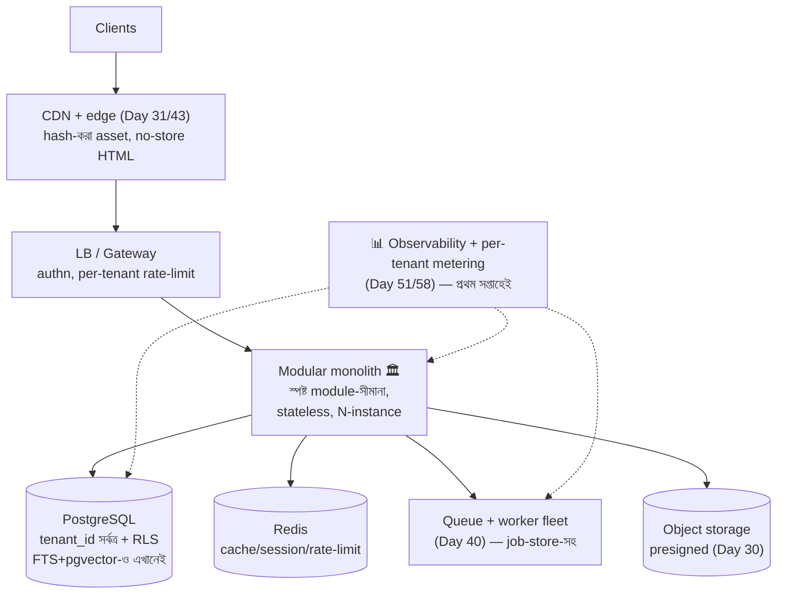

# Day 60 — Scratch থেকে একটা SaaS Platform আর্কিটেক্ট করা (Capstone)

## 🎯 সমস্যা

শেষ দিনের প্রশ্নটা উল্টো ধাঁচের: নির্দিষ্ট এক-দানব নয় — **শূন্য থেকে পুরো একটা B2B SaaS।** আর এখানেই সবচেয়ে বড় ফাঁদটা: ৫৯ দিনের সব অস্ত্র শিখে প্রথম দিনেই সব বসাতে চাওয়া — microservices, event-sourcing, multi-region, CQRS — **user-শূন্য প্লাটফর্মে distributed-systems-এর জাদুঘর।** Capstone-এর আসল পরীক্ষা তাই জ্ঞান নয়, **সংযম আর ক্রম**: কোনটা প্রথম দিনে না-করলে পরে মৃত্যু, আর কোনটা প্রথম দিনে করলে অপচয়?

## 🖼️ প্রথম-দিনের সৎ স্থাপত্য

## 💡 সিদ্ধান্তগুলো — "এখনই" বনাম "সংকেত এলে"

**1. যেগুলো পরে-বদলানো প্রায়-অসম্ভব — এগুলোই প্রথম-দিনের কাজ:**
- **Tenancy-মডেল:** shared-schema + **প্রতিটা টেবিলে tenant_id** + DB-স্তরে row-level-security + প্রতিটা query/log/metric-এ tenant-ট্যাগ (Day 51) — এ শৃঙ্খলা পরে-বসানো মানে শত-টেবিল-অস্ত্রোপচার; আর tenant→ঘর **routing-lookup-স্তরটাও** আজই (দানব-tenant-কে কাল dedicated-ঘরে সরানোর দরজা)।
- **Identity/authz-এর কঙ্কাল:** org→user→role-মডেল, API-তে tenant-সীমা server-side-জোর — নিরাপত্তা-সীমানা refactor-যোগ্য জিনিস নয়।
- **টাকা-ছোঁয়া পথের ব্যাকরণ:** idempotency-key (Day 04/59), ledger-ভাবনায় লেনদেন (Day 33-হালকা-রূপ: append-only টেবিল), state-machine-বৈধ transition (Day 56/57), webhook-দুই-দিকের শৃঙ্খলা (Day 11) — billing পরে এলেও **usage-metering আজ থেকেই** (যা মাপেননি, তার বিল করবেন কীসে?)।
- **চুক্তি-শৃঙ্খলা:** additive-first API + tolerant-reader (Day 52), migration-এ expand-contract-অভ্যাস (Day 53), secret-এ পরিচয়-ভিত্তিক-প্রবেশ (Day 32), deploy-এ flag+canary-পেশি (Day 14) — এগুলো স্থাপত্য নয়, **সংস্কৃতি** — আর সংস্কৃতিই সবচেয়ে আগে জমাট বাঁধে।

**2. যেগুলো ইচ্ছা-করে সরল রাখবেন — সংকেত না-আসা-পর্যন্ত:**
- **Modular monolith, microservices নয়** (Day 47-উল্টো-পথে পড়ুন: ভালো-সীমানার-monolith হলো ভবিষ্যৎ-strangler-এর সেরা পোষক-গাছ) — module-সীমানা কড়া (নিজস্ব-টেবিল-মালিকানা, সীমানা-পেরোনো-ডাক interface-এ), deploy এক;
- **এক PostgreSQL-ই** — FTS (Day 45), pgvector (Day 28), JSONB, DB-as-queue-ও শুরুতে (Day 40) — প্রতিটা নতুন-দোকান এক-নতুন-distributed-system-পোষা (Day 28-এর মন্ত্র); Redis-টুকু নিন (cache/rate-limit — Day 03/08);
- **Async-মেরুদণ্ড অবশ্য প্রথম-দিনেই** — queue+worker+job-store (Day 40/56): এটা "scale-এর জিনিস" নয়, **সঠিকতার জিনিস** (durable-কাজ, retry, idempotency) — আর পরে-বসানো কঠিন সংস্কৃতি-বদল।

**3. Scale-সংকেত → কোন-অস্ত্র (৫৯-দিনের মানচিত্র):** read-চাপ → cache-শৃঙ্খলা (Day 08/18/26) → replica+read-your-writes (Day 19); নির্দিষ্ট-module-এর গতি/দল-স্বাধীনতা → সেটুকুই strangler-এ আলাদা (Day 47) + outbox (Day 22); রিপোর্ট-চাপ → read-model/warehouse-স্তর (Day 09/41/49); দানব-tenant → Day 51-এর সিঁড়ি; বিশ্ব-user → Day 31-এর ক্রম (CDN→edge→replica→pinning); AI-feature → RAG+tools+eval+observability একসাথে (Day 27/34/46/58) — **প্রতিটা জটিলতা ঢোকে টিকিটে-লেখা-সংকেতের-জবাবে, স্থাপত্য-উচ্চাভিলাষে নয়।**

**4. আর প্রথম-সপ্তাহের অদৃশ্য-কাজ:** observability-ভিত (trace+error+per-tenant-খরচ — অন্ধ-প্লাটফর্মে বাকি-সব-অনুমান), backup+restore-**মহড়া** (backup সবাই নেয়, restore ক'জন পেরেছে?), staging+production-মাপের-migration-অভ্যাস, আর এক-পাতার **"আমরা-যা-করি-না"-দলিল** — না-নেওয়া-সিদ্ধান্তও সিদ্ধান্ত, লিখে-রাখলে ছ'মাস-পরের-তর্ক বাঁচে।

## ⚖️ প্রথম-দিন বনাম সংকেত-এলে

| এখনই (উল্টানো-কঠিন) | সংকেত-এলে (উল্টানো-সহজ) |
|----------------------|--------------------------|
| tenant_id+RLS, routing-lookup | Dedicated-tenant-ঘর |
| Idempotency, ledger, state-machine | Event-sourcing-পূর্ণরূপ |
| Modular-সীমানা, চুক্তি-শৃঙ্খলা | Microservices-বিভাজন |
| Queue+worker+job-store | Kafka/streaming (Day 41) |
| Metering+observability | Billing-অটোমেশন, warehouse |
| এক-Postgres (FTS+vector-সহ) | Dedicated search/vector/OLAP |

## ⚠️ Common Mistakes

- Resume-চালিত-স্থাপত্য — "শিখেছি-তাই-বসাব"; ৬০-দিনের-জ্ঞানের সবচেয়ে-পরিণত-ব্যবহার হলো **না-বসানোর-যুক্তি** জানা।
- "পরে-করব"-তালিকায় tenancy/idempotency/metering — এ তিনটেই "পরে"-র-সবচেয়ে-দামি-তিন-শব্দ; বাকি-সব-পরে-চলে, এরা-চলে-না।
- Monolith=এলোমেলো ভাবা — modular-monolith-এর কড়া-সীমানাই একে strangler-যোগ্য রাখে; জট-পাকানো-monolith আর সীমানা-ওয়ালা-monolith এক-জাত নয়।
- সংকেত-মাপার-যন্ত্র-ছাড়া "সংকেত-এলে-করব" — per-tenant/per-module-মেট্রিক না-থাকলে সংকেতটা আসবে incident-রূপে।

## 🎤 Interview Tip

Capstone-উত্তরের কাঠামোটাই নম্বর: **"আগে ভাগ করি — কোন-সিদ্ধান্ত উল্টানো-কঠিন (tenancy, identity, টাকার-ব্যাকরণ, চুক্তি-শৃঙ্খলা: এগুলো প্রথম-দিনেই) আর কোনটা উল্টানো-সহজ (দোকান-বাছাই, সেবা-বিভাজন: এগুলো সংকেতের-জবাবে)।"** তারপর এক-লাইনের-দর্শন: **"শুরুর-স্থাপত্যের-লক্ষ্য নিখুঁত-হওয়া নয় — সস্তায়-বিবর্তনযোগ্য-থাকা; modular-monolith + এক-Postgres + queue-মেরুদণ্ড + মাপার-যন্ত্র — এ চতুষ্টয় থেকে ৫৯-দিনের-যেকোনো-অস্ত্রে যাওয়ার-রাস্তা খোলা।"** — এইটাই পুরো-সিরিজের-সারমর্ম এক-নিঃশ্বাসে।

---

## 🎓 সিরিজ-সমাপ্তি: ৬০-দিনের সুতোগুলো

পেছন-ফিরে-তাকালে-গোটা-সিরিজে-ক'টা-সুতো-বারবার-এসেছে — revision-এ-এই-সুতো-ধরে-পড়ুন:

1. **Atomicity-র-সন্ধান** — check-then-act-ভাঙে (৩৯), constraint/conditional-write-বাঁচায় (৪/১১/৩৯/৫৫/৫৯), dual-write-এর-উত্তর-outbox (২২/২৬/৪৫/৫৩)
2. **At-least-once+idempotency = কার্যত-exactly-once** — ৪, ১১, ২২, ২৫, ৪০, ৪৪, ৫৯
3. **Derived-data পুনর্নির্মাণযোগ্য, truth-এক-জায়গায়** — ৯, ২৩, ২৭, ২৮, ৩৩, ৪১, ৪৫, ৪৯
4. **Expand-contract: সহাবস্থানই-নিরাপদ-বদল** — ১৪, ৪৩, ৪৭, ৫২, ৫৩, ৫৪
5. **Skew-ই-বাস্তবতা: গড়-মিথ্যা-বলে** — ৫, ১৬, ২৩, ২৫, ৫১
6. **সীমা-টানো, সংকেত-দাও, নীতি-লেখো (backpressure-দর্শন)** — ৩, ১৭, ২০, ২৫, ২৯, ৫১
7. **মাপো-আগে (eval/metering/observability), বদলাও-পরে** — ৩৪, ৪৯, ৫১, ৫৪, ৫৮
8. **LLM-প্রকৌশল = পুরনো-distributed-systems + non-determinism + টাকার-মিটার** — ২৭, ২৯, ৪২, ৪৬, ৪৮, ৫৫, ৫৮

শুভকামনা, আব্দুল্লাহ — interview-এর-টেবিলে-এ-সুতোগুলোই-আপনার-গল্প। 🚀
